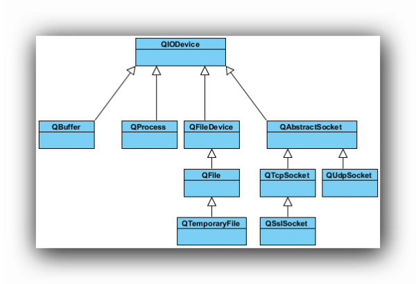

# 文件操作

1. 文件系统


2.  QFile读文件

```c++
#include <QFile>
#include <QFileDialog>
..........
    void Widget::on_pushButtonRead_clicked()
{
    QString path=QFileDialog::getOpenFileName(this,"打开文件","../","all(*.*)");
    if(path.isEmpty()==false)
    {
        QFile file(path);
        bool isOk=file.open(QIODevice::ReadOnly);		//以只读模式打开文件
        if (isOk==true)
        {
            //读文件
            1. 一次性读完
                //默认只识别utf8编码
            QByteArray array=file.readAll();
            ui->textEdit->setText(QString(array));
            //ui->textEdit->setText(array);
            2. 一行一行来读
                QByteArray array;
            while (file.atEnd==false)
            {
                //读一行
                array += file.readLine();
            }
            ui->textEdit->setText(array);
        }
        //关闭文件
        file.close();
        QByteArray 
    }
}
```

3. QFile 写文件

```c++
void Widget::on_pushButtonWrite_clicked()
{
    QString path=QFileDialog::getSaveFileName(this,"保存文件","../","text(*.txt)");
    if(pat.isEmpty==false)
    {
        QFile file;
        //关联文件名字
        file.setFileName(path);		//QFile file(path);
        //打开文件,只写方式
      	bool isOK=file.open(QIODevice::WriteOnly);
        if(isOK==true)
        {
            QString str=ui->textEdit->toPalinText();	//获取编辑区的内容
            //写文件
            file.write(str->toUtf8());					//QString-->QByteArray
            //文件编码格式的转换
            1. 	QString-->string->char*
            	str.toStdString().data();
            2. 	QString-->QByteArray
                2.1		str.toUtf8();		//针对中文
            	2.2 	str.toLocal8Bit();	//本地编码
            3. 	QByteArray-->char*
                QByteArray a;
                char *b = a.data();
            4. 	char * -->QString 
               	char * p = "abc";
            	QString c =QString (p);
        }
        file.close();
    }
}
```

4. QFileInfo获取文件信息

```c++
#include <QFileInfo>
#include <QDateTime>
//获取文件信息
QFileInfo info(path);
qDebug()<<"文件名字"<<info.filename().toQString().data();
qDebug()<<"文件后缀"<<info.suffix();
qDebug()<<"文件大小"<<info.size();
qDebug()<<"创建时间"<<info.created().toString("yyyy-MM-dd hh:mm:ss");
```

5. QDataStream读写文件

```c++
#include <QDataStream>
#include <QDebug>
#include <QFile>
#define cout qDebug()<<"["<<_FILE_"<<":"<<_LINE_<<"]"
Widget::Widget(QWidget *parent) :
    QWidget(parent),
    ui(new Ui::Widget)
{
    ui->setupUi(this);
    writeData();
    readData();
}
void Widget::writeData()
{
    //创建文件对象
    QFile file("../test.txt");
    //打开文件， 只写方式打开
    bool isOk = file.open(QIODevice::WriteOnly);
    if(true == isOk)
    {
        //创建数据流，和file文件关联
        //往数据流中写数据，相当于往文件里写数据
        QDataStream stream(&file);
        stream << QString("主要看气质") << 250;
        file.close();
    }
}
void Widget::readData()
{
    //创建文件对象
    QFile file("../test.txt");
    //打开文件， 只读方式打开
    bool isOk = file.open(QIODevice::ReadOnly);
    if(true == isOk)
    {
        //创建数据流，和file文件关联
        //往数据流中读数据，相当于往文件里读数据
        QDataStream stream(&file);
        //读的时候，按写的顺序取数据
        QString str;
        int a;
        stream >> str >> a;
        qDebug() << str.toUtf8().data() << a;
        cout << str.toUtf8().data() << a;
        file.close();
    }
}
```

6. QTextStream 操作文件

```c++
#include <>
```
7. 总结

    1.  如何读取文件


